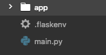
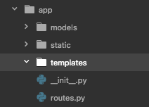

# Initialization

### File Structure

```
project
│   .flaskenv
│   main.py    
│
└───app
│   │  │ routes.py
│   │  │ __init__.py
│   │
│   └───templates
│   |      │ index.html
│   |
│   │
│   └───models
│   │
│   └───static

```

### Flask

```bash

pip3 install flask
pip install python-dotenv

```
if you get a permission error, use sudo

### Create folder

``` bash
cd Desktop ; mkdir 01_flask ; cd 01_flask
```

### Create Root File Structure


### Create App File Structure


### templates
Add a index.html with a short hello message

### routes
```python
from flask import *
from app import app

@app.route('/')
@app.route('/index')
def index():
    return render_template('index.html')
```
### __init__.py

```python
from flask import *
#from flask_bootstrap import Bootstrap

app = Flask(__name__)
#bootstrap = Bootstrap(app)


from app import routes
```

### .flaskenv
add the following lines
```python
FLASK_APP=main.py
FLASK_RUN_HOST=0.0.0.0
FLASK_RUN_PORT=8080
FLASK_DEBUG=1
FLASK_ENV=development
```

In the command line, write export and each line exactly as is.

```bash
export FLASK_APP=main.py
export FLASK_RUN_HOST=0.0.0.0
export FLASK_RUN_PORT=8080
export FLASK_DEBUG=1
export LC_ALL=C.UTF-8
export LANG=C.UTF-8
```


### main.py
```python
from app import app
```

### Run Server
In the root directory, run

```bash
flask run
```

### Todo
- Add three new pages with routes

# Day Two
Create forms and use models

## Forms
Create a new template called form.html and ansDisplay.html

Form to get user's nickname and what they ate for breakfast

```html
<form method="post" action="/ansDisplay ">
  <label for="nickname">What's your nickname?</label>
  <input type='text' name='nickname'>
  <label for="breakfast">What did you have for breakfast?</label>
  <input type='text' name='breakfast'>
  <input type='submit'>
</form>
```

In routes

```python
@app.route('/shoData', methods=['GET','POST'])
def shoData():
    userdata = dict(request.form)
    print(userdata)
    return render_template('shoData.html', name=userdata['name'][0], age=userdata['age'][0])
 
```
In templates

```html
<h1> {{name}} </h1>
<h2> {{age}} </h2>

```

# Day Three
Check out this [api doc](https://developers.giphy.com/docs/)

- create new pages for api_request and api_info
- create a form for the api_request
- update routes to show info take from the form and display it on api_info


# Day Four
- Bootstrap & CSS
